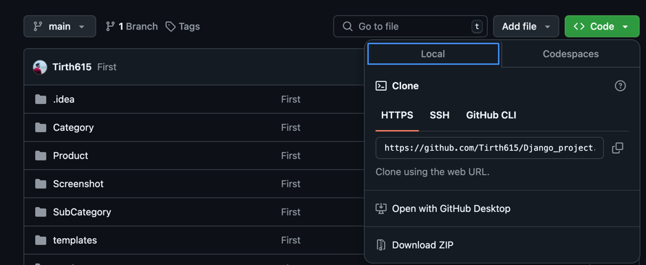

# Django_project 

### Install Requirement

Django==4.2.16
pycparser==2.22
PyMySQL==1.1.1
sqlparse==0.5.1

### Config Database Settings Like 
Change the file in settings.py

    $ 'ENGINE': 'Engine Name',
        'NAME': 'Database Name',
        'USER': 'User Name',
        'PASSWORD': 'Password',
        'HOST': '127.0.0.1',
        'PORT': '3306',

### How To installation Project

Step 1:Clone The Project 

    $ git clone <repository-url>

Step 2: Install Djago
    
    $ pip install django
Step 3: Create Project Name
    
    $python3 django startproject "projectname"

Step 4: Runsarver
    
    $python3 manage.py runserver

step 5: Makemigrations

    $python3 manage.py makemigrations

Step 6: migrate
    
    $python3 manage.py migrate

step 7: Final Step

    $python3 manage.py runserver